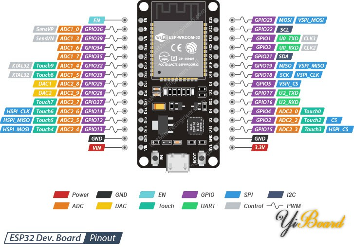
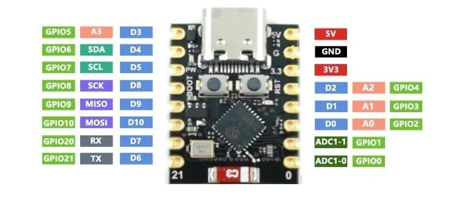
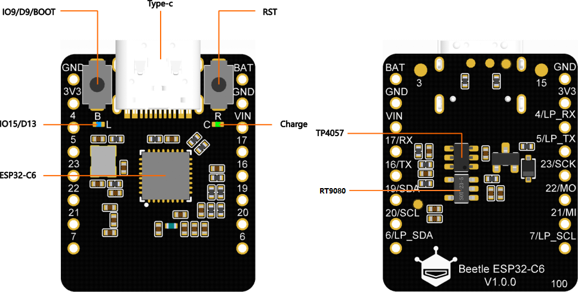

# GPS 测试代码

ublox m10 nona 飞控版 GPS ( 自带天线)
电源接 5V 

``` 
#define GPS_UART_NUM UART_NUM_2 // 使用 ESP32 的 UART2
#define GPS_TX_PIN 17           // ESP32 TX 引脚 (连 GPS RX)
#define GPS_RX_PIN 16           // ESP32 RX 引脚 (连 GPS TX)
#define BUF_SIZE (1024)         // 串口接收缓冲区大小
#define UBX_RATE 38400          // TTL 频率
```

搜星大约1到3分钟, 天线要面向上


esp32-dev-module



esp32-c3 suppermini 




esp32-c6 beetle

